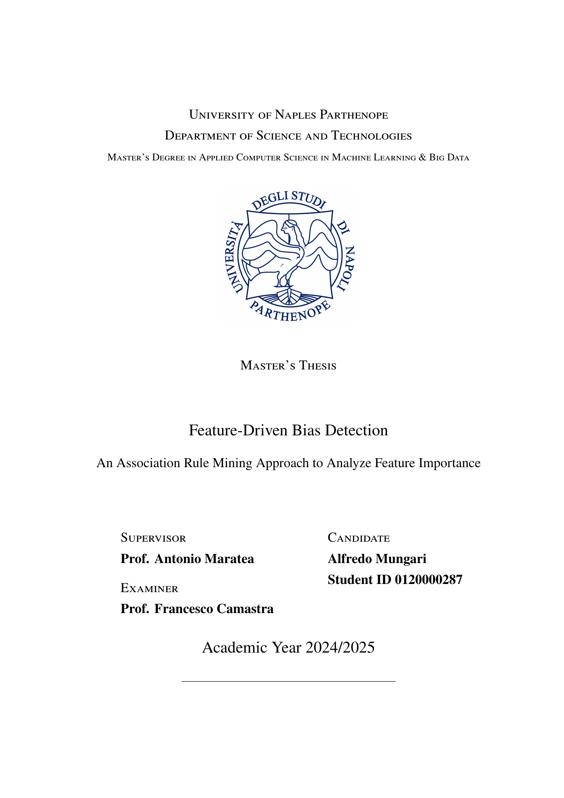

# Master's Thesis — Feature-Driven Bias Detection

<p align="center">
  
</p>

> **Feature-Driven Bias Detection: An Association Rule Mining Approach to Analyze Feature Importance**
>
> Master's Thesis in Applied Computer Science (Machine Learning & Big Data)
> University of Naples "Parthenope" — CI&SS Lab
> Defended on April 23, 2026 — Final grade: **110/110 Summa Cum Laude**

This repository contains the LaTeX source, the compiled PDF, and the defense presentation of my Master's thesis. The accompanying source code (the full Python pipeline) lives in a separate repository: [**mungowz/arm-counterfactual-features**](https://github.com/mungowz/arm-counterfactual-features).

---

## Abstract

Modern tabular classifiers achieve strong predictive performance but remain opaque to inspection, particularly when their decisions involve demographic attributes. This thesis proposes a pipeline that combines **counterfactual-based feature importance** with **hierarchical Association Rule Mining** to produce a global, human-readable interpretation of a classifier's decision logic.

The pipeline adapts the **BoCSoR** method from continuous to fully categorical data through a hybrid encoding and a Manhattan distance formulation, replacing continuous interpolation with the union of relevant feature-category pairs across the *k* observed opposite-class neighbors. The resulting local explanations are aggregated by a two-level mining procedure:

- a **macroscopic level** identifies structural dependencies at the feature-name level;
- a **microscopic level** instantiates each surviving dependency with specific category values.

A conservative semantic classification separates **actionable** rules (involving only modifiable attributes) from **biased** rules (involving protected demographic features).

## Empirical Study

The pipeline is validated on five geographical benchmarks built from the **2024 American Community Survey** (~1.75M records), using two structurally different classifiers (**CatBoost** and **MLP**) and a systematic grid search over support and confidence.

Key findings:

- A consistent **geographic asymmetry**: more affluent benchmarks (Northeast, New York) are dominated by actionable rules, while benchmarks with higher poverty concentration (Texas, South) are dominated by biased rules, with bias-to-actionable ratios ranging from **1.3× to 11.8×**.
- **Race-occupation entanglement** is the dominant biased signature in four of the five scopes.
- The **South uniquely exhibits a race-geography pattern** (`RAC1P ⇒ POBP`) that does not emerge as dominant elsewhere.
- Rules at the **higher-income boundary** emerge only in New York, and only for broad counterfactual neighborhoods.

## Contributions

1. Adaptation of the **BoCSoR** method to fully categorical data.
2. **Hierarchical (macroscopic / microscopic) mining design** for global rule extraction.
3. **Conservative semantic classification** of rules into *actionable* vs *biased*.
4. **Empirical characterization** of geographic bias asymmetries across five U.S. Census benchmarks.

## Repository Structure

```
.
├── main.tex                # Thesis root document
├── master_thesis.pdf       # Compiled thesis PDF
├── chapters/               # Individual chapter sources
│   ├── introduction.tex
│   ├── state_of_the_art.tex
│   ├── data.tex
│   ├── method.tex
│   ├── results.tex
│   ├── conclusions.tex
│   └── appendix.tex
├── bibliography.bib        # References
├── assets/                 # Figures and images
└── presentation/           # Defense presentation (LaTeX + PDF)
```

## Related Work

- **Foundational paper:** A. L. Alfeo, A. G. Zippo, V. Catrambone, M. G. C. A. Cimino, N. Toschi, G. Valenza. *From local counterfactuals to global feature importance: efficient, robust, and model-agnostic explanations for brain connectivity networks*. **Computer Methods and Programs in Biomedicine**, vol. 236, 2023, art. 107550. [[DOI]](https://doi.org/10.1016/j.cmpb.2023.107550) — introduces the original **BoCSoR** measure for continuous data, which this thesis adapts to fully categorical tabular data.
- **Source code:** [mungowz/arm-counterfactual-features](https://github.com/mungowz/arm-counterfactual-features) — the full 4-stage Python pipeline implementing the methodology described here.
- **Supervisor:** Prof. Antonio Maratea
- **Examiner:** Prof. Francesco Camastra

## Citation

If this work is useful for your research, please consider citing:

```bibtex
@mastersthesis{mungari2026biasdetection,
  author  = {Mungari, Alfredo},
  title   = {Feature-Driven Bias Detection: An Association Rule Mining
             Approach to Analyze Feature Importance},
  school  = {University of Naples "Parthenope"},
  year    = {2026},
  type    = {Master's Thesis},
  address = {Naples, Italy}
}
```

## Author

**Alfredo Mungari**
[GitHub](https://github.com/mungowz) · [LinkedIn](https://www.linkedin.com/in/alfredo-mungari-99ab9225a) · [ResearchGate](https://www.researchgate.net/profile/Alfredo-Mungari-2)

## License

The thesis content is released under [**CC BY 4.0**](https://creativecommons.org/licenses/by/4.0/) — you are free to share and adapt for any purpose, including commercial, provided you give appropriate credit. See [LICENSE.md](LICENSE.md) for full details.
